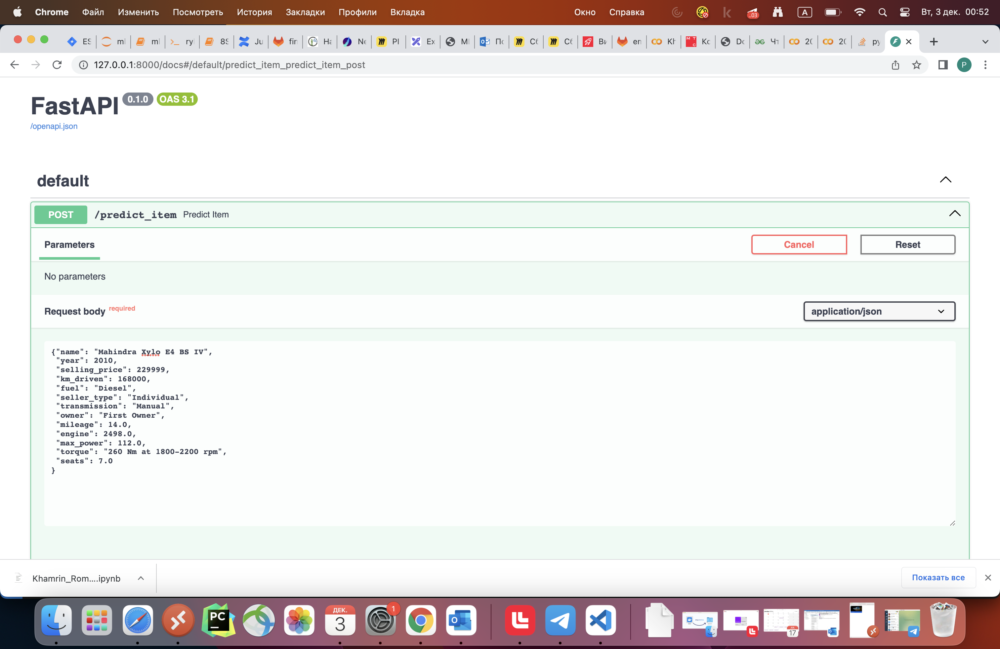
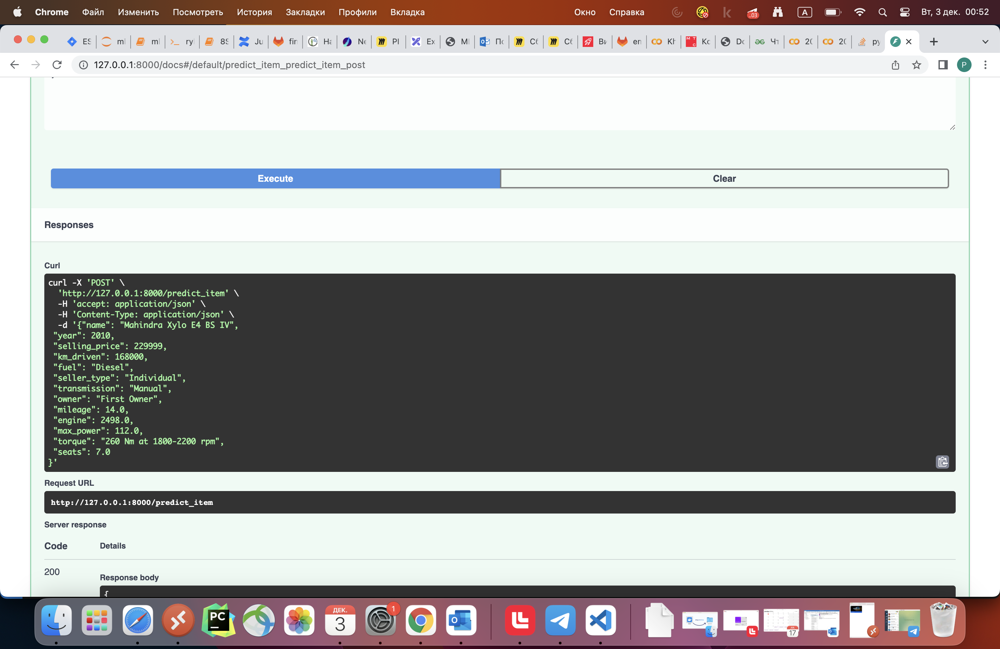
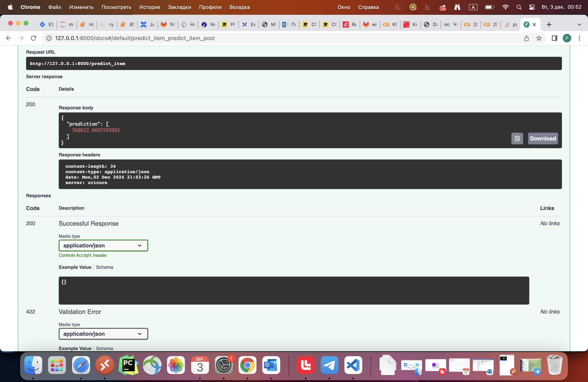
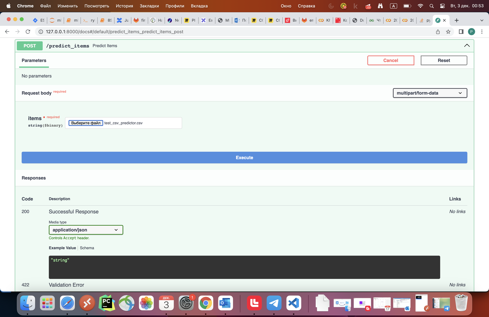
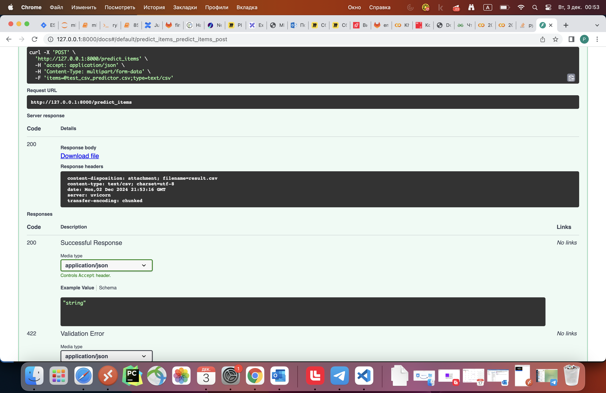

# car_price

## Содержание репозитория
Репозиторий состоит из нескольких папок: 
1. Папка notebooks, в которой лежит jupyter-ноутбук с выполненным заданием и скрипт для развертывания сервиса на fastapi
2. Папка pickles, в которой лежат файлы модели, скеллера и OHE формата pickle
3. Папка pictures, в которой лежат подписанные скриншоты применения развернутого с помощью fastapi сервиса  
## Ход работы
В ходе работы были выполнены следующие шаги: 
1. Изучение данных -- оценка пропусков, просмотр колонок
2. Визуализация данных -- построение дашборда, а также подсчет корреляции признаков между собой и с целевой переменной 
3. Предобработка признаков -- приведение к нужному типу данных, чистка значений, заполнение пропусков
4. Написание ручных метрик R^2 и R^2-adjusted
5. Обучение моделей: сначала только на числовых признаках, затем с добавлением категориальных переменных с использованием OHE 
6. Подбор гиперпараметров линейной регрессии, Lasso, Ridge, ElasticNet с помощью Grid-Search
7. Написание бизнесовых метрик и учет требований бизнеса 
8. Разворачивание собственного сервиса с помощью fastapi
## Наилучший буст
Наилучший буст в метриках дало использование категориальных признаков -- использование всех возможных переменных повысило r^2, понизило mse и бизнес-метрики
## перспективы
Перспективами являются:
1. Внедрение новых признаков
2. Продвинутая чистка выбросов (с помощью алгоритмов машинного обучения) -- например, IsolationForest
3. Продвинутое кодирование признаков -- например, TargetEncoding
## Скриншоты работы сервиса 

### Функционал predict_item

### Функционал predict_items

